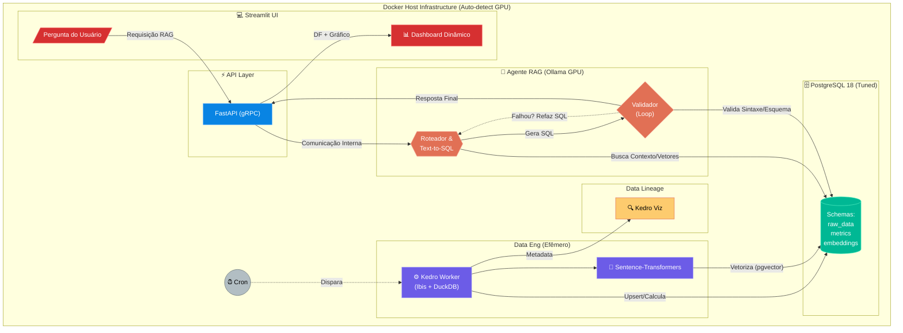

# Ecommerce MLOps & GenAI Pipeline


[](https://kedro.org)
[](https://www.python.org/)
[](https://www.docker.com/)
[](https://www.postgresql.org/)
[](https://ollama.com/)

[](https://console.cloud.google.com/marketplace/product/bigquery-public-data/thelook-ecommerce?project=bigquery-484420)


[](https://github.com/Rafael-soares-oliveira/ecommerce_mlops_genai_pipeline/actions/workflows/ci.yml)


<br>

## 1. Objetivo do Projeto

O objetivo primário desta arquitetura é fornecer uma plataforma analítica end-to-end altamente eficiente, projetada para operar em cenários de baixo recurso e com baixo volume de dados, mas com máxima performance, robustez e precisão.

O sistema orquestra a ingestão e transformação de arquivos Parquet em tabelas relacionais de métricas de negócio, vetoriza metadados para busca semântica e disponibiliza uma interface interativa via Streamlit. Através de um Agente RAG (Retrieval-Augmented Generation), o usuário pode fazer perguntas em linguagem natural, que são convertidas em consultas SQL validadas. A comunicação entre a interface gráfica e o motor RAG/PostgreSQL ocorre via API gRPC, retornando respostas e visualizações dinâmicas com baixa latência e sem intervenção técnica.

<br>

## 2. Arquitetura do Sistema

O fluxo de dados abaixo descreve a topologia dos containers Docker e o ciclo de vida dos dados, divididos entre o processamento em Batch (ETL) e a Inferência em Tempo Real (RAG e UI Interativa).



### 2.1. Detalhamento dos Componentes

#### Infraestrutura e Pipeline Batch (ETL)
* ⏰ Cron: Agendador local responsável por disparar o script de orquestração (`run_job.sh`) em janelas de tempo pré-definidas para ingestão incremental.
* ⚙️ Kedro Worker (Ibis + DuckDB): Container efêmero que encapsula a lógica de extração e transformação. Utiliza a engine do DuckDB via Ibis para processar os arquivos Parquet de forma vetorizada, mitigando o alto consumo de RAM característico do Pandas.
* 🧠 Sentence-Transfomers: Nó do pipeline responsável por ler o dicionário de dados e metadados estruturados, convertendo-os em representações vetoriais (embeddings)

<br>

## 3. Escolhas Tecnológicas e Justificativas Arquiteturais

A stack foi selecionada sob a premissa de **"foco absoluto em eficiência e baixo volume de dados"**, infraestrutura imutável via Docker e otimização de recursos de hardware.
* **Docker com Detecção de GPU (`start.sh`)**: Script de inicialização detecta automaticamente a presença de uma GPU Nvidia via `nvidia-smi` e aplica um override no docker-compose (`docker-compose.gpu.yml`). Isso garante que o projeto seja portável entre ambientes de desenvolvimento (CPU) e produção (GPU) sem alterações manuais de código.
* **PostgreSQL 18 Tunado (Timescale + pgvector)**: A imagem Docker base do PostgreSQL foi customizada no `Dockerfile` e no `init.sql`.
	* A memória `maintenance_work_mem` foi elevada para 1 GB para garantir a construção rápida de índices HNSW (crucial para RAG rápido).
	* O `jit` foi desabilitado, pois em queries vetorizadas simples ele adiciona overhead desnecessário.
	* O agrupamento de dados (`raw_data`, `metrics`, `embeddings`) em schema distintos no mesmo banco consolida a infraestrutura relacional, analítica e vetorial.
* **Kedro Worker Efêmero (`run_job.sh`)**: O `kedro-worker` não roda continuamente. Ele é um container efêmero disparado sob demanda que morre após concluir o pipeline de dados, liberando memória do host. O script também reinicia o `streamlit` e o `kedro-viz` para limpar caches em memória após a carga de novos dados.
* **FastAPI (gRPC)**: Atua como a ponte de comunicação entre o Streamlit (front-end) e o Agente RAG/Banco de Dados. O uso de gRPC garante tipagem estrita (Protobufs) e serialização binária ultrarrápida, mitigando a latência na transferência dos DataFrames e das respostas do SLM.
* **Ollama (`OLLAMA_KEEP_ALIVE=10m`)**: Para equilibrar a latência de resposta com a eficiência de infraestrutura, o Ollama foi configurado para descarregar o SLM da VRAM da GPU após 10 minutos de inatividade (*idle*). Essa decisão de arquitetura garante que a GPU não fique bloqueada consumindo energia desnecessariamente enquanto o RAG não está em uso, aceitando um pequeno cold-start apenas na primeira requisição de uma nova sessão de uso do Streamlit.
* **Cache de Modelos no Docker Build (UV)**: O `Dockerfile.app` utiliza a ferramenta `uv` e a montagem de cache (`--mount=type=cache`) no Docker para baixar o modelo `Sentence-Transformer` (`all-MiniLM-L6-v2`) durante a construção da imagem. Isso evita downloads redundantes a cada inicialização dos containers, isolando o ambiente.

<br>

## 4. Pipeline de Dados: Passo a Passo e Decisões de Engenharia

O projeto é dividido em dois ciclos operacionais distintos: o processamento em Batch (ETL) e a inferência em tempo real.

### Fase 1: Ingestão e Preparação Batch (Execução Efêmera)

1. **Extração e Transformação Ibis/DuckDB**: O Kedro executa transformações usando o Ibis, que delega o processamento para o DuckDB. Isso garante velocidade vetorizada na leitura dos arquivos de origem (Parquet) sem consumir RAM excessiva, substituindo as operações custosas do Pandas.
2. **Carga no PostgreSQL via Custom Dataset (Ibis Upsert)**: O Kedro não possui um conector robusto para realizar operações de UPSERT nativas via Ibis no PostgreSQL. O desenvolvimento de um Custom Dataset garante que os dados em `raw_data` e as métricas geradas sejam inseridos de forma **idempotente**. Execuções repetidas do `run_job.sh` não duplicarão os registros.
3. **Vetorização (Sentence-Transformers)**: Após a criação das métricas, os metadados (esquemas, descrições, dicionários de dados) são passados pelo cache do modelo local (configurado no `.env` via `HF_HOME`) e salvos no schema `embeddings` via `pgvector`.

### Fase 2: Motor Analítico RAG (Tempo Real via API e UI)

1. **Input do Usuário**: O usuário envia uma pergunta na interface do Streamlit.
2. **Camada API (FastAPI gRPC)**: O Streamlit envia a requisição para a API. A API centraliza a conexão persistente (pool de conexões) com todo o banco PostgreSQL (abrangendo os schemas `embeddings`, `raw_data`, `metrics`).
3. **Busca Semântica (Hybrid Search)**: A API aciona o banco para realizar uma busca nos `embeddings`, utilizando recursos avançados configurados no `init.sql` (como `pg_trgm` para buscas híbridas ou índices dedicados), recuperando as tabelas e colunas com maior relevância para a pergunta.
4. **Prompt Roteador (Text-to-SQL)**: O esquema retornado pela busca é enviado ao Ollama, que gera a query SQL.
5. **Loop de Validação (Self-Correction)**: Prevenção de quebra do sistema por alucinação de IA. A API tenta executar a query (ou rodar um `EXPLAIN`) no banco. Se ocorrer um erro de sintaxe ou de mapeamento (ex: coluna inexistente), o erro do PostgreSQL é capturado e enviado de volta ao Ollama para correção automática.
6. **Entrega e Visualização**: Com a query validada, a API extrai o DataFrame final do PostgreSQL, decide qual o melhor tipo de gráfico e trafega a resposta final via gRPC de volta para o Streamlit renderizar o Dashboard.

<br>

## 5. Engenharia de Dados: Orquestração e Padrões com Kedro

A camada de preparação de dados foi arquitetada sobre o framework **Kedro**, operando de forma efêmera e contêinerizada. Para garantir que o pipeline respeite as premissas de baixo consumo de recursos e alta performance, o comportamento padrão do Kedro foi estendido através de Hooks customizados e Custom Dataset do Kedro-datasets.

### 5.1. Observabilidade e Monitoramento de Recursos (Hooks e Logging)

Em ambientes contêinerizados que compartilham hardware com modelos de IA (SLMs/GPUs), vazamentos de memória (*memory leaks*) ou picos de processamento na etapa de ETL podem derrubar o *Docker Host*. Para mitigar isso, implementamos:
* **Logging Estruturado (`logging.yml`)**: Separação clara entre logs informativos e de erro, com rotatividade automática (`RotatingFileHandler` com backup de até 50 MB no total). Isso garante que o disco não encha com logs antigos do container efêmero.
* **`ResourceMonitoringHook`**: Um hook injetado no ciclo de vida do Kedro que atua como um inspetor de recursos.
	* Utiliza a biblioteca `psutil` para capturar a memória RAM exata (*RSS*) antes e depois da execução de cada *Node*.
	* Mede o delta de memória e o tempo de execução (em segundos).
	* Dispara *flags* de alerta (`HIGH MEMORY`) no log caso um nó ultrapasse o limite seguro estipulado no `parameters.yml` (ex: 1000 MB). Isso permite identificar imediatamente transformações não-otimizadas.

### 5.2. Otimização de Banco de Dados via Ciclo de Vida `CreateIndexesHook`

A manipulação de dados em massa (Bulk Load) em tabelas que possuem índices complexos — especialmente os índices vetoriais `HNSW` do *pgvector* — sofre de grave degradação de performance.
Para resolver isso, o `CreateIndexesHook` altera o fluxo padrão de DDL (Data Definition Language):
1. `before_pipeline_run`: Conecta ao PostgreSQL e executa os scripts DDL iniciais para garantir que as tabelas do schema `raw_data` existam.
2. `after_pipeline_run`: Apenas após toda a carga de dados ser finalizada, o hook executa a criação dos índices (B-Tree para métricas e HNSW para vetores). Criar índices sobre tabelas já populadas é mais rápido e eficiente do que atualizar o índice linha a linha durante o *Insert*.

### 5.3. Ingestão de Alta Performance `IbisUpsertDataset`

O gargalo de qualquer pipeline ETL moderno é a etapa de escrita no banco de dados. O Kedro nativo não oferece suporte eficiente para operações idempotentes de `UPSERT` usando Ibis/PostgreSQL. A classe `IbisUpsertDataset` foi criada para solucionar isso combinando o padrão *Factory* com serialização em baixo nível.
Como funciona:
1. **Zero-Copy e Arrow**: Os dados transformados pelo DuckDB são convertidos para `PyArrow`.
2. **Protocolo Binário (`pgpq`)**: Em vez de gerar milhares de instruções `INSERT INTO` (que saturam a rede e a CPU), o dataset utiliza a biblioteca `pgpq` para codificar os dados do Arrow diretamente para o formato binário nativo do PostgreSQL.
3. **Carga em Memória (COPY)**: Usa a instrução `COPY FROM STDIN WITH (FORMAT BINARY)` para jogar os dados em uma tabela temporária de forma quase instantânea.
4. **Merge Inteligente (Upsert)**: Compara a tabela temporária com a tabela final. Ele gera dinamicamente uma cláusula `ON CONFLICT DO UPDATE` que só sobrescreve o dado se a linha original e a nova forem diferentes (`IS DISTINCT FROM`). Isso economiza operações de escrita em disco (I/O) e não infla o *Write-Ahead Log* (WAL) do banco à toa.

### 5.4. Catálogo Dinâmico e DRY `catalog.yml`

O Catálogo de Dados foi desenhado seguindo o princípio *DRY* (*Don't Repeat Yourself*).
* **Padrões Dinâmicos (`{table}`)**: Em vez de mapear dezenas de tabelas manualmente, o catálogo usa sintaxe de fábrica. A chamada `raw_{table}` mapeia automaticamente qualquer arquivo `.parquet` na camada `01_raw` através da engine do DuckDB em memória.
* **YAML Anchors**: A configuração do banco de dados (esquema de destino, credenciais, uso da classe customizada `IbisUpsertDataset`) foi encapsulada no *anchor* `&postgres_upsert_base`. Para criar uma nova entidade no pipeline, basta referenciar a base e passar o `table_name`, tornando a manutenção do projeto limpa e escalável.

### 5.5. Pipeline de Processamento e Qualidade de Dados (`data_processing`)

O pipeline de extração e transformação (`data_processing`) atua como a barreira de qualidade e integridade do Data Warehouse. Em vez de utilizar o Pandas tradicional, que carregaria todos os dados na RAM, o pipeline utiliza **Ibis** para delegar a computação para o DuckDB (arquivos brutos) e PostgreSQL, processando dados de forma vetorizada.
### A. Validação de Qualidade em Passagem Única (Single-Pass Validation)

Geralmente, validações de Data Quality (como verificar valores nulos, preços negativos ou limites geográficos) exigem múltiplas varreduras nos dados ou loops custosos.
* `schema_rules.py`: Define um contrato estrito de dados contendo regras granulares (linhas) e regras estruturais (agregações, como detecção de duplicidade).
* `_validate_ibis_table`: É o motor de regras. Em vez de validar linha a linha, esta função compila todas as regras do contrato em um **único bloco de agregações Ibis** e executa a query diretamente no banco/engine. Se qualquer regra violar a condição (retornando valor `> 0`), o pipeline aborta com um `ValueError`, detalhando exatamente a falha no log. Isso garante que "lixo não entre" no banco de dados (*Garbage in*, *Garbage Out*).

#### B. Proteção de Integridade Referencial Dinâmica (Cross-Engine Joins)

Um dos maiores desafios de cargas em bancos relacionais é o erro de restrição de chave estrangeira (Foreign Key Constraint), que faz o pipeline inteiro "quebrar" na hora do `INSERT`.
Para evitar isso, o pipeline realiza a higienização prévia dos dados através de uma técnica de **Cross-Engine Join**:
1. O pipeline converte os IDs já validados no PostgreSQL para `PyArrow` e os carrega como uma `ibis.memtable` (tabela virtual em memória).
2. Utiliza *joins* nos dados de origem e nos dados das *Foreign Keys* (que estão no DuckDB lendo o Parquet):
	* **Anti-Join**: Identifica registros órfãos (ex: um Produto que aponta para um Centro de Distribuição que não existe) e os registra nos logs como *warnings* analíticos.
	* **Semi-Join**: Filtra a base original, mantendo apenas as linhas que possuem correspondência válida.
Isso garante que o comando final de `UPSERT` nunca falhe por falta de referências no banco.

#### C. Estratégias de Carga Incremental

Como a arquitetura visa baixo consumo de recursos, recarregar a base inteira todos os dias é inviável. O pipeline emprega duas estratégias distintas de ingestão:
* **Watermarking**: Para a tabela `inventory_items`, o nó consulta o banco de dados destino (`target`) para descobrir a data máxima inserida (`max(created_at)`). Apenas registros *posteriores* a esta data são processados.
* **Moving Window**: Para tabelas transacionais altamente mutáveis (`orders` e `order_items`), o pipeline utiliza um `lookback` em dias (configurado no *parameters*). Ele processa apenas os pedidos dos últimos `X` dias, já que faturamentos antigos raramente sofrem atualização de status (de *Processing* para *Shipped*, por exemplo).

#### D. Imutabilidade e Consistência Funcional

A transformação de tipagem e regras de negócio (ex: garantir que a data de entrega não seja anterior à de envio) no arquivo `transform_tables.py` obedece a um fluxo puro: entra uma `ibis.Table`, sai uma `ibis.Table`.
Para injetar as validações sem poluir a sintaxe visual do Kedro, foi criado o utilitário `create_node_func` (com `functools.partial`). Ele aplica os contratos de esquema de forma transparente, garantindo que o `kedro-viz` e os logs de terminal mostrem os nomes reais das funções, mantendo a observabilidade intacta.


## Tech Stack

- **Gerenciamento**: `uv` (Astral)
- **Orquestração**: Kedro + Kedro-Viz
- **Processamento**: Ibis + PyArrow
- **Qualidade de Código**: Ruff (Lint), Ty (Typing), Pytest (Testes)
- **Banco de Dados**: PostgreSQL + pgvector + postGIS + TimescaleDB (via Docker), DuckDB
- **Modelos AI**:
  - *Embedding*: `all_MiniLM-L6-v2` (local)
  - *SLM*: `deepseek-r1:1.5b` (via Ollama) (local)

## Estrutura do Repositório

``` plaintext
.
├── conf # Configurações do Kedro
│   ├── base/                     # Configurações padrão e compartilhadas
│   │   ├── catalog.yml           # Data Catalog
│   │   ├── globals.yml           # Parâmetros compartilhados entre YML
│   │   └── parameters.yml        # Parâmetros dos pipelines
│
│   ├── local/                    # Sobrescrições locais e credenciais (ignorado no git)
│   ├── logging.yml               # Configuração do Logger
│   └── README.md                 # Documentação dos arquivos de configuração
│
├── data/                         # Armazenamento local particionado pelas camadas do Kedro
│   ├── 01_raw/                   # Dados brutos e imutáveis
│   ├── 02_intermediate/          # Dados limpos e tipados
│   ├── 03_primary/               # Dados padronizados para o modelo de domínio
│   ├── 04_feature/               # Features de machine learning
│   ├── 05_model_input/           # Matrizes e tensores para treinamento
│   ├── 06_models/                # Modelos serializados
│   ├── 07_model_output/          # Inferências e predições
│   └── 08_reporting/             # Dados agregados para visualização
│
├── junit/                        # Relatórios de testes exportados pelo Pytest/GitHub Actions
├── logs/                         # Arquivos de log locais
├── notebooks/                    # Rascunhos e experimentações (ignora no git)
├── pyproject.toml                # Configurações do projeto e ferramentas
├── README.md                     # Este arquivo
├── sql/                          # Scripts e queries SQL
│   ├── embeddings/               # Scripts para criação e indexação de tabelas de vetores
│   ├── init.sql                  # Script de inicialização do banco de dados (junto com o Docker)
│   ├── metrics/                  # Scripts para criação e indexação de tabela de métricas
│   └── raw_data/                 # Scripts para criação e indexação de tabelas pós-tratamento
│
├── src/
│   └── thelook_ecommerce_analysis/
│       ├── datasets/             # Implementação de datasets customizados
│       ├── hooks.py              # Hooks de execução do Kedro
│       ├── pipeline_registry.py  # Registro central dos pipelines disponíveis
│       ├── settings.py           # Configurações globais de execução do Kedro
│       ├── utils/                # Funções utilitárias
│       └── pipelines             # Pipelines de dados
│           └── data_processing   # Extração, transformação e carga inicial
│
├── tests/                        # Testes unitários espelhando a estrutura do src/
│   ├── datasets/                 # Testes dos custom datasets
│   ├── kedro_settings            # Testes das configurações do Kedro
│   ├── pipelines                 # Testes das lógicas dos pipelines e nodes
│   └── utils                     # Teste das funções utilitárias
│
├── docker-compose.yml            # Definição dos serviços
├── Dockerfile                    # Imagem do banco de dados PostgreSQL
├── Dockerfile.app                # Imagem da aplicação Kedro
├── start.sh                      # Script para iniciar serviços de infra
├── run_job.sh                    # Instancia o container efêmero do Kedro para execução
├── down.sh                       # Encerra serviços e limpa volumes
└── uv.lock                       # Lockfile de dependências gerenciado pelo UV
```

## Como Executar

### Pré-requisitos

- [Docker Engine](https://docs.docker.com/engine/install) (Pode ser configurado para [Podman](https://podman.io/docs/installation))
- GPU Nvidia (mudar configuração para outras GPUs) / CPU também disponível, porém mais lento

1. **Clone o repositório**:

```
git clone https://github.com/Rafael-soares-oliveira/ecommerce_mlops_genai_pipeline
cd ecommerce_mlops_genai_pipeline
```

2. **Configure o ambiente**: Crie uma cópia do arquivo de variáveis de ambiente.
```
cp .env.example .env
```

3. **Inicie a infraestrutura base**: Este script levanta o banco de dados e o servidor Ollama, detectando automaticamente o uso de GPU.
```
bash start.sh
```

4. **Execute o pipeline de dados (ETL)**: Dispara o container efêmero do Kedro para ingestão, transformação e geração de embeddings.
```
bash run_job.sh
```

5. **Acesse as interfaces**:
* **Streamlit (UI)**: `http://localhost:8501`
* **Kedro-Viz (Lineage)**: `http://localhost:4141`
* **pgAdmin**: `http://localhost:8080`

## Tabelas de Métricas

- **Métricas de Vendas e Receita**: Focada no desempenho financeiro.
  - **Tabelas Fonte**: `order_items`, `orders`, `products`.
  - **Métricas**:
    - **GMV (Gross Merchandise Value)**: Soma total do valor das vendas (`sale_price`).
    - **Ticket Médio (AOV)**: Média de gasto por pedido.
    - **Taxa de Cancelamento**: % de pedidos com status `Cancelled`.
- **Métricas de Clientes (CRM e Retenção)**: Focada no comportamento e valor do usuário ao longo do tempo.
  - **Tabelas Fonte**: `users`, `orders`.
  - **Métricas**:
    - **LTV (Lifetime Value)**: Valor total gasto por usuário desde o cadastro.
    - **Análise de Cohort**: Retenção de usuário agrupados pelo mês de aquisição (safra).
    - **RFM (Recência, Frequência, Monetário)**: Segmentação de clientes para marketing.
    - **Novos vs. Recorrentes**: Proporção de vendas de primeira compra vs. recompra.
- **Métricas de Produto e Estoque**: Focada na logística e atratividade do item.
  - **Tabelas Fonte**: `inventory_items`, `products`, `order_items`, `distribution_center`.
  - **Métricas**:
    - **Taxa de Devolução**: % de itens com status `Returned`.
    - **Tempo de Envio**: Diferença entre `created_at` e `shipped_at`.
    - **Margem de Produto**: Diferença entre `sale_price` e `cost`.
    - **Aging do Estoque**: Tempo que os itens ficam no inventário antes da venda.
- **Métricas de Navegação (Web Analytics)**: Focada no funil de conversão no site.
  - **Tabelas Fonte**: `events`.
  - **Métricas Possíveis**:
    - **Taxa de Conversão de Sessão**: Visitantes únicos que compram / Total de visitantes.
    - **Abandono de Carrinho**: Usuários que adicionam ao carrinho (`cart`) mas não compram (`purchase`).
    - **Origem de Tráfego**: Análise da coluna `traffic_source`.

## Roadmap de Implementação (Planejamento)

Este planejamento foca nas entregas lógicas, sem datas fixas.

### Fase 1: Fundação & Infraestrutura

- [X] Configurar repositório com `.gitignore` e `pyproject.toml`.
- [X] Criar `docker-compose.yml`, `Dockerfile` e scripts `sh`.
- [X] Configurar/Validar conexão com o Banco de Dados.

### Fase 2: Core Engineering (Kedro ETL)

- [X] Inicializar projeto Kedro (`kedro new`).
- [X] Configurar `crendentials.yml` e `parameters.yml`.
- [X] Configurar `conf/base/logging.yml` e configurar Hooks do Kedro.
- [X] Criar testes unitários para testar hooks.py e settings.py
- [X] Registrar datasets no `catalog.yml`.
- [X] Implementar **Pipeline de Transformação**:
  - [X] Limpeza com Ibis.
  - [X] Lógica de Watermark (Upsert) lendo do Postgres.
- [X] Criar testes com pelo menos 90% coverage
- [X] Configurar pipeline de CI (GitHub Actions) para rodar `ruff`, `ty`, `pytest` e gerar relatórios.
- [X] Documentar no README.md

### Fase 3: Métricas, Vetores e AI

- [ ] Implementar **Pipeline de Embeddings**:
  - [ ] Node para gerar vetores de descrições de produtos.
  - [ ] Criar testes com pelo menos 90% coverage
  - [ ] Documentar no README.md
- [ ] Implementar **Pipeline de Métricas**:
  - [ ] Node para criar tabelas de métricas
  - [ ] Criar testes com pelo menos 90% coverage
  - [ ] Documentar no README.md
- [ ] Implementar **Pipeline de SLM Batch**:
  - [ ] Configurar modelo e contexto
  - [ ] Node que agrega métricas diárias.
  - [ ] Integração com API do Ollama para gerar resumos textuais.

### Fase 4: Consumo e Visualização

- [ ] Configurar API gRPC e Protobufs.
- [ ] Configurar Streamlit.
- [ ] Cria dashboard modelo no Streamlit.
- [ ] Criar Dashboard no Streamlit.
- [ ] Implementar Chatbot RAG no Streamlit.
